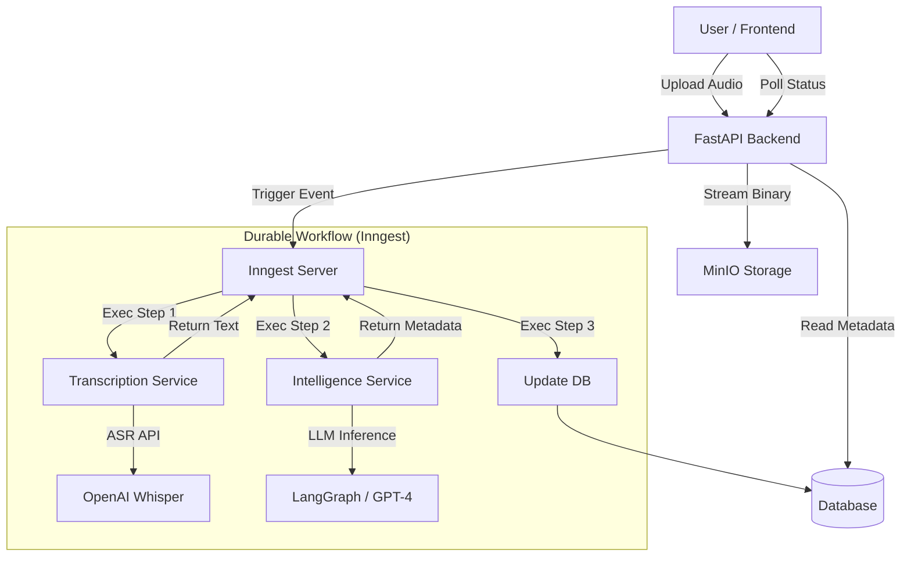

# Intelligent Voicemail Orchestration System

This document provides a comprehensive overview of the Intelligent Voicemail System, including its architecture, prerequisites, and setup guide. It is designed to be consumed by both human developers and AI agents.

## 1. System Architecture

The system utilizes an **Event-Driven Architecture (EDA)** logic to handle voicemail processing asynchronously and reliably. It leverages "Durable Execution" to manage complex, multi-step AI workflows.

### High-Level Data Flow
1.  **Ingestion**: User records audio in the Frontend. Audio is streamed directly to MinIO (Object Storage) via the FastAPI Backend.
2.  **Event Trigger**: The Backend generates an event (`voicemail/received`) and sends it to the Inngest Orchestrator.
3.  **Durable Workflow**: Inngest triggers the `process_voicemail` function:
    *   **Step 1 (Transcription)**: Audio is downloaded and sent to OpenAI Whisper.
    *   **Step 2 (Intelligence)**: Transcript is analyzed by LangGraph (GPT-4) to extract intent, urgency (Red/Yellow/Green), and metadata.
    *   **Step 3 (Persistence)**: Results are stored in the database.
4.  **Presentation**: The Frontend polls the Backend for status updates and displays the analysis in real-time.

### Components

| Component | Technology | Role |
| :--- | :--- | :--- |
| **Frontend** | React, Vite, TailwindCSS | User Interface for recording and viewing voicemails. Uses Optimistic UI and Polling. |
| **Backend** | FastAPI, Python 3.11 | API Gateway. Handles uploads and serves data. |
| **Orchestrator** | Inngest | Manages the durable execution graph, retries, and state. |
| **Storage** | MinIO | S3-compatible Object Storage for raw audio files. |
| **AI Services** | OpenAI Whisper, LangGraph | Transcription and NLU (Natural Language Understanding). |
| **Database** | In-Memory (Mock) | Stores metadata. Structured via Repository pattern for easy migration to Postgres. |

### Architecture Diagram (Mermaid)



---

## 2. Prerequisites

Before running the system, ensure the following are available:

### System Requirements
*   **Docker Desktop**: Running and up-to-date (handles all services).
*   **Git**: To clone the repository.
*   **Make** (Optional): For running helper scripts if added.

### External Services
*   **OpenAI API Key**: Required for audio transcription and intelligence analysis.
    *   Must have access to `whisper-1` and `gpt-4-turbo` models.

---

## 3. Getting Started

Follow this guide to spin up the entire stack from environment setup to running the application.

### Step 1: Clone and Configure

1.  Make sure you are in the project root.
2.  Navigate to the `backend` directory to configure environment variables.

```bash
cd backend
cp .env.example .env
```

3.  Open `.env` in your text editor and paste your OpenAI API Key.

```ini
# backend/.env
OPENAI_API_KEY=sk-proj-xxxxxxxxxxxxxxxxxxxxxxxx
```

### Step 2: Spin Up Docker

Return to the project root and start the container orchestration. This command builds the Python backend, the Node.js frontend, and pulls the MinIO and Inngest images.

```bash
cd ..  # Back to project root
docker-compose up --build
```

**What happens during this step:**
*   **MinIO** starts and a sidecar script creates the `voicemails` bucket.
*   **Inngest** starts the local development server.
*   **Backend** installs Python dependencies and starts Uvicorn.
*   **Frontend** installs Node modules and runs `npm run dev` exposed on port 3000.

### Step 3: Access the Application

Once the logs settle and you see "Ready to check for items", access the following interfaces:

*   **User Interface**: [http://localhost:3000](http://localhost:3000)
    *   *Usage*: Click the microphone to record. Stop to upload. Watch the triage happen.
*   **Inngest Dashboard**: [http://localhost:8288](http://localhost:8288)
    *   *Usage*: View the `process_voicemail` function trace, inputs, and outputs.
*   **MinIO Console**: [http://localhost:9001](http://localhost:9001)
    *   *Credentials*: `admin` / `password123`

### Development Notes

*   **Frontend Dev**: The frontend container runs `vite` with hot-reload enabled. You can edit files in `frontend/src` and the browser will update instantly.
*   **Backend Dev**: The backend container runs `uvicorn` with `--reload`. Changes to `backend/app` will trigger a server restart.

### Troubleshooting

*   **"OpenAI Key Missing"**: If the analysis returns "Mock Intent", ensure you restarted Docker after adding the key to `.env`.
*   **Audio Upload Fails**: Check if MinIO is healthy at port 9000.
